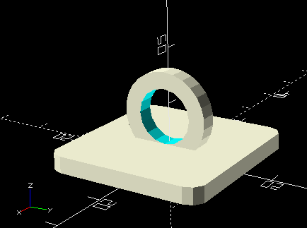

# Lamp Hook
This is a hook to get a lamp attached to the ceiling with a rope that lets you adjust the height that best works for you. 
You need to stick it with double sided tape.



## Release notes:
### V1.0.0
* This design is parametrizable to make it customizable and adaptable to any size of lamp.
* Look at this pictures to get a better understanding of which kind of lamps can be use with this design:
 [LED Tube lamps](https://www.google.com/search?q=tube+led+lamps&tbm=isch&ved=2ahUKEwjAxqTY9ufqAhUS0awKHbv9CxIQ2-cCegQIABAA&oq=tube+led+lamps&gs_lcp=CgNpbWcQAzIGCAAQCBAeULgUWLgUYO4VaABwAHgAgAFiiAFikgEBMZgBAKABAaoBC2d3cy13aXotaW1nwAEB&sclient=img&ei=huUbX8DrJJKiswW7-6-QAQ&bih=635&biw=1360&rlz=1C1GCEA_enUS899US899) - Some pictures from google

## How to customize it:
You can play around these variables:
```
//---------Base dimentions
base_thick =  3;
base_length = 30;
//---------Ring dimensions
ring_thick =                3;   //ring thick
external_ring_radius=       8;   //internal ring radius
internal_ring_radius =      5; //internal ring radius
ring_grip = external_ring_radius - internal_ring_radius;  
                                /*ring_grip is a grip among base and ring (Z axis offset)
                                This is the difference among external and internal diameter 
                                (that's the reason why I multiply it times 2)
                                */
```
## Building the 3D model
* It was designed using [OpenSCAD] (https://www.openscad.org/) version 2019.05
* Demo STL is available in outputfiles folder
* Gcode was gotten using Cura 4.6.2

## Installation